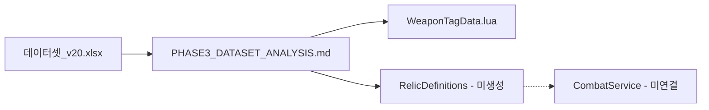
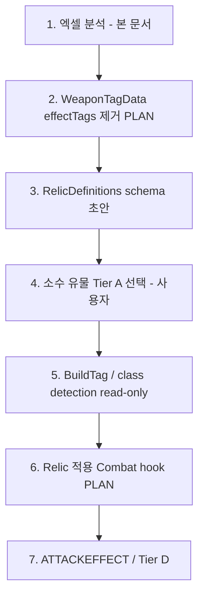

# Phase 3 Dataset Analysis (v20)

엑셀 **`데이터셋_v20_RL_TAGS_드롭다운_실제복구_v2.xlsx`** 를 read-only로 분석한 Phase 3 설계 단서 문서다.  
**본 문서만으로 코드·게임 동작은 변경되지 않는다.**

| 항목 | 값 |
|------|-----|
| 입력 경로 | `c:\Users\roung\OneDrive\Desktop\로블록스\ROGUE\데이터셋_v20_RL_TAGS_드롭다운_실제복구_v2.xlsx` |
| 분석 일자 | 2026-05-27 |
| 분석 시트 | WP.TAGS, RL.TAGS, CLASS, ATTACKEFFECT, UPGRADE (+ 워크북 전체 시트 목록) |
| 코드 수정 | **없음** (`src/` 미변경) |

---

## 산출 요약 (요청 형식)

| # | 항목 | 내용 |
|---|------|------|
| 1 | 생성 문서 경로 | `docs/PHASE3_DATASET_ANALYSIS.md` |
| 2 | 시트별 역할 요약 | §1 Workbook Overview |
| 3 | RL.TAGS 컬럼 매핑 | §3.4 |
| 4 | 유물 Tier 분류 기준 | §4 |
| 5 | 3무기 우선 분석 대상 | §2.3, §3.5, §5 |
| 6 | Phase 3 MVP 적용 순서 | §8 |
| 7 | 코드 수정 여부 | **없음** |

---

## 1. Workbook Overview

### 1.1 워크북 시트 목록 (실측)

| 시트 | UsedRange (대략) | Phase 3 관련도 | 역할 요약 |
|------|------------------|----------------|----------------|
| **WP.TAGS** | 1000×25 | **핵심** | 무기별 태그 SSOT(엑셀). `typeTags`·`weaponTags`·`attackTags`·`rangeTags`·`tempoTags` |
| **RL.TAGS** | 1007×26 | **핵심** | 유물 정의·태그·검수(`O`)·클래스 필터(우측 ClassTagList) |
| **CLASS** | 37×17 | **핵심** | 무기 `weaponTag` ↔ 기초/파생 직군·설명·강화효과 플래그 |
| **ATTACKEFFECT** | 999×26 | **참조** | 상태이상·공격 패턴 enum·스택/틱 규칙 (런타임 구현 전 설계 사전) |
| **UPGRADE** | 1000×26 | **참조** | 런 내 레벨업 업그레이드 정의·`구현` 상태 |
| MATERIAL | 1×1 | 보류 | v20에서 거의 비어 있음 — 재료·제작은 후속 |
| ENEMY | 1000×26 | 보류 | 스테이지/웨이브와 별 트랙 |
| STAGE | 1000×26 | 보류 | 층·스테이지 설계 (Phase 3 태그 MVP 범위 밖) |
| UI 정리 | 1000×26 | 보류 | UI 카피·정리 |
| 로비 | 1000×26 | 보류 | 로비 플로우 메모 |

### 1.2 Phase 3에서 이 워크북의 위치

- **지금:** 엑셀 → 본 문서 (정책·매핑·Tier 기준)
- **다음:** 승인된 소수 유물만 `RelicDefinitions` schema 초안 → 구현 선택은 사용자
- **금지(본 턴):** `RelicDefinitions.lua` 생성, 유물 기능 구현, `CombatService` 연결

---

## 2. WP.TAGS 분석

### 2.1 엑셀 컬럼 구조 (v20 실측)

헤더 행 기준(열 E~J, 0-indexed `[4]`~`[9]`):

| 엑셀 헤더 | 코드 필드명 (권장) | 비고 |
|-----------|-------------------|------|
| 무기명 | `displayName` (+ 파싱으로 `weaponId`) | 예: `방패검 (swordshield)` |
| typeTags | `typeTags` | `melee` / `range` / `magic` / `ex` |
| weaponTags | `weaponTag` | 단일 코드: `ss`, `th`, `sp`, … |
| attackTags | `attackTags` | 콤마 구분 → 배열 |
| rangeTags | `rangeTags` | 단일 값 (6단계 중 하나) |
| tempoTags | `tempoTags` | `normal` / `slow` / `fast` |

**`effectTags` 컬럼:** v20 WP.TAGS 시트 **UsedRange 내 헤더·데이터에 존재하지 않음** (25열 중 태그 축은 위 5개만 확인).  
다른 버전/확장 시트에 `effectTags` 열이 있더라도 **Phase 3 `WeaponTagData` schema에는 포함하지 않는다** (아래 §2.4).

### 2.2 무기 태그 축 정리

| 축 | 역할 | 예시 값 |
|----|------|---------|
| typeTags | 무기 **계열** (Melee/Range/Magic) | `melee`, `range`, `magic`, `ex` |
| weaponTag | 무기 **식별 코드** (CLASS·RL 매칭 키) | `ss`, `th`, `sp`, `bo`, `fi` |
| attackTags | **공격 형태** (sweep/thrust/shot…) | `sweep`, `thrust`, `throw, area, sweep` |
| rangeTags | **사거리 밴드** (6단계) | `superclose` … `longrange` |
| tempoTags | **템포** | `normal`, `slow`, `fast` |

**의도적으로 WP.TAGS에 두지 않는 축**

- `burn`, `bleed`, `freeze`, `knockback`, `pierce`, `block` 등 **상태·효과·CC**  
  → **유물(RL.TAGS)**, **ATTACKEFFECT**, **CLASS**, 후속 **effect system**에서 부여·해석한다.  
  → 무기 행이 이런 태그를 “기본 보유”한다고 보지 않는다.

### 2.3 구현 3무기 vs future weapon

| 구분 | weaponId (코드) | 엑셀 무기명 | weaponTag | rangeTags | 레포 `WeaponTagData.lua` |
|------|-----------------|-------------|-----------|-----------|---------------------------|
| **구현됨** | `SwordShield` | 방패검 (swordshield) | `ss` | `close` | ✅ 행 존재 |
| **구현됨** | `TwoHandedSword` | 양손검 (twohandedsword) | `th` | `mid` | ✅ |
| **구현됨** | `Spear` | 창 (spear) | `sp` | `mid` | ✅ |
| future | (미구현) | 도끼~바람 등 11종 + 트랩 | `ax`…`tr` | 각 행 참조 | ❌ 테이블 미포함 |

**엑셀 전체 무기 행 (15종):**

| 무기명 | type | weapon | attack | range | tempo |
|--------|------|--------|--------|-------|-------|
| 방패검 (swordshield) | melee | ss | sweep, thrust | close | normal |
| 양손검 (twohandedsword) | melee | th | sweep | mid | slow |
| 창 (spear) | melee | sp | thrust | mid | slow |
| 도끼 (axe) | melee | ax | sweep | close | normal |
| 쌍검 (twinblade) | melee | tb | thrust | superclose | fast |
| 수리검 (shuriken) | range | sh | throw | closerange | fast |
| 활 (bow) | range | bo | shot | midrange | normal |
| 석궁 (crossbow) | range | cr | shot | longrange | slow |
| 대포 (cannon) | range | ca | shot | longrange | slow |
| 차크람 (chakram) | range | ch | throw, area, sweep | midrange | normal |
| 불 (fire) | magic | fi | area | midrange | normal |
| 얼음 (ice) | magic | oc | thrust | closerange | slow |
| 전기 (electricity) | magic | el | chain | longrange | fast |
| 바람 (wind) | magic | wi | area | midrange | normal |
| 트랩 (trap) | ex | tr | `-` | `-` | `-` |

### 2.4 WeaponTagData schema 정책 (Phase 3 코드)

**유지 필드 (SSOT 축):**

- `weaponId`
- `displayName`
- `weaponTag`
- `typeTags`
- `attackTags`
- `rangeTags`
- `tempoTags`

**제거 방향:**

- `effectTags` — **schema에서 제외**한다.  
- 레포 `WeaponTagData.lua` (2026-05-27 기준)에는 아직 `effectTags`가 들어 있으나 (`block`/`knockback`/`pierce`/`slash` 등), 이는 **엑셀 WP.TAGS가 아닌 초기 스텁**이며 **후속 PLAN에서 필드 삭제·검증 배열 수정** 대상이다. **본 문서 작성 턴에서는 `src/` 미수정.**

**`effectTags` 해석 원칙:**

| 주체 | 역할 |
|------|------|
| 무기 (`WeaponTagData`) | 형태·사거리·템포만 — **효과 태그 기본 부여 없음** |
| 유물 (`RL.TAGS`) | `modifierTags` / `effectTargetTags` / `triggerTags`로 타깃·수치·상태 부여 |
| ATTACKEFFECT | 런타임 상태이상 enum·스택 규칙 |
| CLASS | 직군 detection·향후 직업 강화 (구현은 별도) |

### 2.5 rangeTags 6단계 (유지)

`WeaponTagData.RangeOrder` 와 엑셀 값이 일치한다. **통합·축소 금지.**

| 순서 | tag | 엑셀 사용 예 |
|------|-----|--------------|
| 1 | `superclose` | 쌍검 |
| 2 | `close` | 방패검, 도끼 |
| 3 | `mid` | 양손검, 창 |
| 4 | `closerange` | 수리검, 얼음 |
| 5 | `midrange` | 활, 차크람, 불, 바람 |
| 6 | `longrange` | 석궁, 대포, 전기 |

### 2.6 `none` / `-` 처리 규칙

| 엑셀 표기 | 코드 태그 배열 | 문자열 리터럴 |
|-----------|----------------|---------------|
| `none`, 빈 칸, `-` (트랩 attack/range/tempo) | `{}` (빈 테이블) | `"none"` **금지** |
| 콤마 구분 다중 태그 | `split → trim → 배열` | — |

트랩(`tr`)은 attack/range/tempo가 `-` → Phase 3 구현 전까지 **빈 배열 3종**으로 문서화만 하고, 무기 테이블 추가는 **별도 PLAN**.

### 2.7 엑셀 ↔ 코드 대조 (구현 3무기)

| weaponId | 엑셀 | 코드 (WeaponTagData) | 일치 |
|----------|------|----------------------|------|
| SwordShield | ss / sweep,thrust / close / normal | 동일 (displayName만 영문) | ✅ |
| TwoHandedSword | th / sweep / mid / slow | 동일 | ✅ |
| Spear | sp / thrust / mid / slow | 동일 | ✅ |

**불일치(정책):** 코드만 `effectTags` 보유 → **제거 예정**, 엑셀 기준 없음.

---

## 3. RL.TAGS 분석

### 3.1 시트 레이아웃

- 상단: **ClassTagList** + **ClassTag Filter** (O열 `ClassTag Match` = TRUE 필터용)
- 본문: **RELICS** 테이블 — `검수` 열에 **`O`** 인 행만 “활성/검수 완료” 유물로 집계
- 우측 열(16+): 파생 직군명 등 **클래스 후보 리스트** (필터·교차참조용, 행마다 값이 비어 있을 수 있음)

### 3.2 주요 컬럼 (헤더 행 실측)

| Col | 헤더 | Phase 3 역할 |
|-----|------|----------------|
| 0 | 검수 | `O` = 분석·구현 후보 집계에 포함 |
| 1 | 번호 | 디자인 ID (코드 `relicId` 후보와 별도 매핑 필요) |
| 2 | 유물군 | Scope / 분류 (Type / Weapon / Ability / Player) |
| 3 | 유물명 | 표시명·에셋 키 후보 |
| 4 | 이미지 | 에셋 |
| 5 | 효과 | 기획 설명 (사람 읽기용) |
| 6 | classTags | **직군·계열·공통** 태그 (Guardian, Slayer, Melee, Magic…) |
| 7 | effectTargetTags | **적용 대상** (`ss`, `th`, `sp`, `sweep`, `block`, `Magic`…) |
| 8 | modifierTags | **수치·행동 변경 종류** (`Damage`, `Status_Add`, `Attack_Amount`…) |
| 9 | triggerTags | **발동 조건** (`on_hit`, `passive`, 빈 값=상시) |
| 10 | ObtainTags | 획득 경로 (`Crafted` 등) |
| 11 | UnlockTags | 해금 (`Blueprint` 등) |
| 12 | stackTags | `Stackable` / `Unique` / `Upgradeable` |
| 13 | Required Materials | 제작 재료 (MATERIAL 시트 연동 예정) |
| 14 | ClassTag Match | 필터 TRUE/FALSE |

### 3.3 `O` 표시 유물 통계 (실측)

| 지표 | 값 |
|------|-----|
| **검수 `O` 유물 수** | **175** |
| Weapon-based (무기 유물) | 115 |
| Ability/tag-based (능력 유물) | 29 |
| Type-based (계열 유물) | 17 |
| player-based (플레이어 유물) | 14 |

**`modifierTags` 상위 (O 행 기준):**

| modifierTags | 대략 건수 |
|--------------|-----------|
| Status_Add | 27 |
| Crush_Add | 6 |
| Critical_Add | 5 |
| Damage | 4 |
| Effect_Add, Projectile_Count, Knockback_Add, … | 각 3 이하 다수 |

→ Phase 3 MVP에서 **Status_Add 계열이 가장 많은 “시스템 의존” 묶음**이다.

### 3.4 태그 컬럼 역할 · 코드 schema 매핑 제안

**제안 모듈:** `RelicDefinitions` (파일명·경로는 별도 PLAN — **본 턴 미생성**)

| 엑셀 필드 | Lua 필드 (제안) | 타입 | 비고 |
|-----------|-----------------|------|------|
| 검수 `O` | `enabled` | boolean | `O` → true |
| 유물명 | `displayName` | string | |
| (신규) | `relicId` | string | snake_case, `RelicData` 기존 ID와 매핑 테이블 |
| 유물군 | `scope` | enum | `Type` / `Weapon` / `Ability` / `Player` |
| classTags | `classTags` | `{string}` | 직군 detection 입력 |
| effectTargetTags | `effectTargetTags` | `{string}` | `ss`,`th`,`sp`,`sweep`,`block`… |
| modifierTags | `modifierTags` | `{string}` | 파서: `Damage / Cooldown` → 분리 권장 |
| triggerTags | `triggerTags` | `{string}?` | 빈 값 → `{}` 또는 `always` |
| ObtainTags | `obtainTags` | `{string}` | |
| UnlockTags | `unlockTags` | `{string}` | |
| stackTags | `stackRule` | enum | Stackable / Unique / Upgradeable |
| 효과 (설명) | `designNotes` | string | 런타임 미사용 |
| Required Materials | `craftMaterials` | table? | MATERIAL 연동 후 |

**해석 규칙 (WP.TAGS와 동일 계열):**

- `none`, `-`, 빈 칸 → 해당 **태그 배열은 `{}`**
- **`effectTargetTags`의 `Thrust` / `Sweep` 등** → 공격 패턴 타깃 (ATTACKEFFECT·`attackTags`와 교차)
- **상태이상 이름은 `modifierTags: Status_Add` + 기획 텍스트**에 두고, MVP에서는 **ATTACKEFFECT 런타임 구현 전** 태그 문자열만 보존

### 3.5 현재 3무기·3직군 우선 분석

**CLASS 기초직군 ↔ weaponTag (엑셀):**

| weaponTag | 기초직군 (CLASS) | 요약 |
|-----------|------------------|------|
| `ss` | **Guardian** | 블록·생존 |
| `th` | **Slayer** | Sweep 광역 |
| `sp` | **Lancer** | Thrust 직선 |

**`O` 유물 중 classTags 일치 건수 (실측):**

| classTags | 건수 |
|-----------|------|
| Guardian | 6 |
| Slayer | 5 |
| Lancer | 5 |

**effectTargetTags에 `ss` / `th` / `sp` 포함 (부분 문자열 매칭, 실측):**

| target | 대략 건수 |
|--------|-----------|
| ss | 12 |
| th | 11 |
| sp | 9 |

**레포 `RelicData.lua`와 RL.TAGS 이름 대응 (이미 구현된 소수):**

| 코드 relicId | RL.TAGS 유물명 | classTags | modifierTags (엑셀) |
|--------------|----------------|-----------|---------------------|
| `old_shield_emblem` | Old Shield Emblem | Guardian | Damage (target: block) |
| `cracked_sword_tip` | Cracked Sword Tip | Guardian | Crit_Chance / block (ss) |
| `knights_belt` | Knight's Belt | Guardian | Cooldown (ss) |
| `reinforced_shield_rim` | Reinforced Shield Rim | Guardian | Block_chance |
| `needle_edge` | Needle Edge | Lancer | (Thrust target) |
| `rhythm_strap` | Rhythm Strap | Guardian | cooldown |
| `shield_spike` | Shield Spike | Paladin | Knockback_Power (ss) |

→ 엑셀에는 **Paladin·Riftcleaver·Impaler** 등 파생직군 유물이 많고, MVP **class detection**은 기초 3직군만 먼저 잡아도 된다.

---

## 4. 구현 난이도 분류 기준 (Tier A~E)

**개별 유물의 Tier 표는 사용자가 구현 목록을 정할 때 채운다.** 여기서는 **분류 정책**만 고정한다.

| Tier | 정의 | RL.TAGS 신호 (예) | Phase 3 |
|------|------|-------------------|---------|
| **A** | **즉시 구현 가능** — 기존 `RelicData` 패턴(데미지/쿨 배율)만으로 표현 | `Damage`, `Defense`, `Cooldown`, `Crit_Chance`, 단일 `ss`/`th`/`sp` | MVP 1차 후보 |
| **B** | **3무기 한정** — `UpgradeData`·무기 프로필은 있으나 RL만 확장 | `Attack_Amount`, `Attack_Range`, weaponTag 타깃 | MVP 2차 (무기별) |
| **C** | **태그 시스템 필요**, Combat hook 작음 | `Effect_Add`, `Projectile_Count`, `Area_Add`, `Knockback_Add` | 태그 리졸버 후 |
| **D** | **상태이상·트리거 시스템** 필요 | `Status_Add`, `on_hit`, `passive`+복합 effect | ATTACKEFFECT·트리거 후 |
| **E** | **future weapon·복합·미구현 무기** | `bo`,`fi`, `Change`, Aura·Orbit·Chain 전용 | 보류 |

**예시 매핑 (정책 설명용, 구현 확정 아님):**

| 유물 (O) | Tier | 이유 |
|----------|------|------|
| Knight's Belt / Rhythm Strap | A | Cooldown — `RelicData`와 동형 |
| Cracked Sword Tip | A | Crit — 배율·플래그 수준 |
| Roid Rage | B | `th` + Attack_Amount — TH 전용 로직 |
| Hunter's Instinct | E/C | Range 계열 — `bo` 미구현 |
| Sunder Wedge | D | Status_Add + on_hit + armorbreak |
| Mage's Wish | E | Magic 계열 전체 |

**집계 힌트:** `O` 175건 중 `Status_Add` 27건 → **다수가 Tier D**로 기울어 있음. MVP는 **A·B 위주 소수 선택**이 안전하다.

---

## 5. CLASS 시트 분석

### 5.1 구조

- **계열:** Melee / Range / Magic (열 블록)
- **기초직군:** weaponTag 1:1 (Guardian↔ss, Slayer↔th, Lancer↔sp, …)
- **파생직군:** 3단(특화 A/B, 디버프형) — Bulwark, Executioner, Paladin, Riftcleaver 등
- **직업 강화효과:** `V` 표시만 — **런타임 로직 없음** (플래그)

### 5.2 Phase 3 MVP class detection 후보

| 후보 | weaponTag | detection 입력 | 구현 없이 가능? |
|------|-----------|----------------|-----------------|
| **Guardian** | `ss` | `WeaponTagData.weaponTag == "ss"` | ✅ detection만 |
| **Slayer** | `th` | `weaponTag == "th"` | ✅ |
| **Lancer** | `sp` | `weaponTag == "sp"` | ✅ |

**가능한 1단계:** `activeWeapons` 주 무기 → `WeaponTagData` → `classTags = { "Guardian" }` 등 **라벨 부여만**.  
**불가/보류:** Sweep 증강·블록 확률 등 **직업 강화효과** — CLASS 설명문에 있으나 코드·Combat hook 필요.

### 5.3 파생직군과 RL.TAGS

RL.TAGS의 `classTags`는 **기초·파생 혼재** (예: `Paladin`, `Slayer`, `Common`).  
MVP detection은 **기초 3직군만** 매핑하고, 파생은 **유물 보유·태그 누적**으로 후속 승급 설계한다.

---

## 6. ATTACKEFFECT 분석

### 6.1 상태이상·효과 enum 후보 (시트에 등장하는 이름)

**도트·CC·디버프:** Burn, Freeze, Paralyze, Bleed, Knockback, Curse, Airborne, Stun, Blind, ArmorBreak, Slow, Pull, Mark  

**공격 패턴·무기 연계:** Attack, Slash, Pierce, Critical, Combo, Crush, Explosion, Sweep, Thrust, Stab, Shot, Chain, Beam, Nova, Slam, Ricochet, Frenzy, Drain, Combustion, Orbit, Block, Evade, Execution  

(시트에 **Aura blade** 등 표기 변형 있음 — 코드 enum은 **정규화 테이블** 필요.)

### 6.2 Phase 3 MVP에서 바로 구현하지 말아야 할 이유

1. **스택·틱·중복 규칙**이 시트마다 상이 (Burn 5스택, Freeze 3초 속박 등).  
2. **CombatService**에 훅·VFX·네트워크 동기화가 없음.  
3. RL.TAGS **27건+ `Status_Add`** — 효과 하나당 시스템 공사에 가깝다.  
4. `UpgradeData`·무기 데미지 파이프라인과 **중첩·곱연산 순서** 미정.

### 6.3 권장 보존 방식

| 단계 | 행동 |
|------|------|
| 지금 | `RelicDefinitions`에 `modifierTags` / `effectTargetTags` / `designNotes` **문자열만 저장** |
| 다음 | ATTACKEFFECT → `EffectKind` enum 문서·테이블 (구현은 Tier D 이후) |
| 연결 | 유물이 `Status_Add` + `Burn`이면 **해석기**가 enum으로 매핑 — **무기 WP.TAGS에는 넣지 않음** |

---

## 7. UPGRADE 시트 분석

### 7.1 현재 레포와의 관계

| 항목 | 엑셀 (v20) | 레포 `UpgradeData.lua` |
|------|------------|-------------------------|
| 무기군별 업그레이드 | `ss_*`, `th_*`, `sp_*`, `ab_*` 등 | 동일 ID 다수 **구현** |
| 구현 상태 열 | `구현` | 코드에 정의 존재 |
| **실측 행 수** | id 있는 행 **25**, 전부 `구현` | — |

### 7.2 유물 `modifierTags`와 충돌 가능성

| modifierTags (유물) | UPGRADE 유사 축 | 충돌 유형 |
|---------------------|-----------------|-----------|
| `Damage` | `*_damage` | 곱연산 순서·상한 |
| `Cooldown` / `cooldown` | `*_cooldown` | AttackInterval 중복 적용 |
| `Attack_Amount` | (무기 타격 수) | TH sweep 히트 수 — 별도 레이어 필요 |
| `Attack_Range` / `Range` | `*_range`, `*_angle` | 사거리·각도 중복 |
| `Defense` / `Block_chance` | (업그레이드에 없음) | 상대적으로 안전 |

**정책 제안:**

1. **레이어 분리:** `upgrades` (런 레벨업) vs `relicModifiers` (런 유물) — `UpgradeData.getEffectiveCombatStats` **이후** 또는 **명시적 단계**에서 relic 적용 (`RelicData.getCombatMultipliers`가 이미 선례).  
2. **동일 축 중복 시:** 설계표에 **곱셈 / 가산 / 최솟값** 중 하나를 SSOT로 고정 (미정이면 Tier A도 위험).  
3. **`Damage / Cooldown` 복합 modifier** — 파서로 쪼개지 않으면 코드 분기 불가.

### 7.3 연결 가능성 (개념)

- 유물 Tier A는 **`RelicData`의 `SweepDamageMul`·`AttackIntervalMul`** 와 동일 축 → **UPGRADE와 같은 최종 스탯 객체**에 합산.  
- Tier B `Attack_Amount`는 **무기별 CombatService 분기** — UPGRADE 정의와 **ID 공유하지 않음**.

---

## 8. Phase 3 적용 전략

### 8.1 권장 순서

| 단계 | 산출 | 비고 |
|------|------|------|
| 1 | `PHASE3_DATASET_ANALYSIS.md` | ✅ 본 문서 |
| 2 | `WeaponTagData`에서 `effectTags` 제거 | **별도 APPROVE_PATCH** |
| 3 | `RelicDefinitions` schema | **미생성 (본 턴)** |
| 4 | Tier A 유물 3~7종 선택 | 사용자 결정 |
| 5 | Class detection (Guardian/Slayer/Lancer) | 효과 없이 태그만 |
| 6 | Combat 연결 | `RelicData` 확장 또는 신규 모듈 |
| 7 | 상태이상 시스템 | ATTACKEFFECT 기반 |

### 8.2 당장 코드화하면 안 되는 것

- RL.TAGS **175종 일괄** `RelicDefinitions` 이관  
- `Status_Add` / ATTACKEFFECT **전면 Combat 구현**  
- future 12무기 `WeaponTagData` **전량 등록** (구현 없는 무기)  
- CLASS **파생직군·강화효과** gameplay 적용  
- MATERIAL / STAGE / ENEMY **연동**  
- `CombatService` **직접 패치** (본 요청 명시 금지)

### 8.3 3무기 우선 작업 묶음 (권장)

1. **WP.TAGS:** `ss` / `th` / `sp` 행만 `WeaponTagData` 유지 (effectTags 제거는 별도 PLAN)  
2. **CLASS:** Guardian / Slayer / Lancer detection 스펙 문서화  
3. **RL.TAGS:** `O` ∩ (`classTags` ∈ 3직군 **또는** `effectTargetTags` ∋ ss/th/sp) ∩ Tier A/B  
4. **UPGRADE:** 기존 25종 유지 — 유물은 **같은 스탯 축만** 골라 충돌 검토  
5. **Starting/Dropped relic:** `RelicData` ID ↔ 엑셀 유물명 매핑 테이블을 `RelicDefinitions`로 이전할 때 **snake_case id** 통일

---

## 부록 A. WP.TAGS vs WeaponTagData — effectTags 정책 요약

| 질문 | 답 |
|------|-----|
| 엑셀 v20에 `effectTags` 열? | **없음** |
| 다른 버전에 있으면? | 문서·매핑表에만 “원본 컬럼 존재” 기록 가능, **코드 schema 제외** |
| 무기가 pierce/knockback 기본 보유? | **아니오** |
| 효과 태그 출처 | 유물 · ATTACKEFFECT · CLASS · effect system |
| `none` / `-` | 빈 배열 `{}` |

---

## 부록 B. 참조 파일 (레포, 읽기 전용)

| 파일 | 용도 |
|------|------|
| `src/ReplicatedStorage/Shared/WeaponTagData.lua` | 구현 3무기 태그 (`effectTags` 스텁 — 제거 예정) |
| `src/ReplicatedStorage/Shared/RelicData.lua` | Starting/Dropped 소수 유물 |
| `src/ReplicatedStorage/Shared/UpgradeData.lua` | 레벨업 업그레이드 SSOT |
| `docs/CHOICE_FLOW_CURRENT_AND_PHASE3_PLAN.md` | ChoiceKind·pending (유물 오퍼 맥락) |
| `docs/PHASE2_MVP_CLOSURE_AND_PHASE3_ENTRY.md` | Phase 2 클로저·진입 조건 |

---

## 변경 이력

| 날짜 | 내용 |
|------|------|
| 2026-05-27 | v20 엑셀 실측 기반 초안 작성. `effectTags` schema 제외 정책 반영. 코드 수정 없음. |
