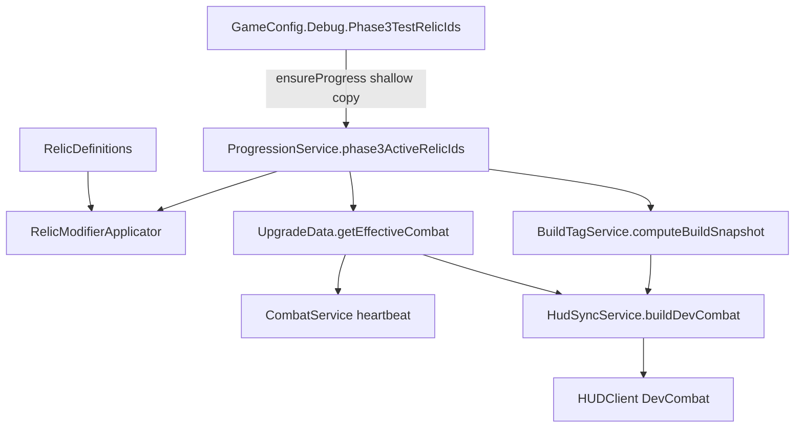

# Phase 3 MVP — Current Architecture (Playtest-Verified)

**목적:** 현재까지 **실플레이로 검증된** Phase 3 구조를 SSOT 문서로 고정한다.  
**범위:** 분석·설계·구현 가이드의 기준선. 이 문서만으로 게임 동작이 바뀌지 않는다.

| 항목 | 값 |
|------|-----|
| 문서 경로 | `docs/PHASE3_MVP_CURRENT_ARCHITECTURE.md` |
| 코드 정본 | `src/` + `default.project.json` |
| 선행 문서 | `docs/PHASE3_DATASET_ANALYSIS.md`, `docs/PHASE3_RELIC_CANDIDATE_TRIAGE.md`, `docs/CHOICE_FLOW_CURRENT_AND_PHASE3_PLAN.md` |
| 최종 갱신 기준 | Phase 3 MVP: relic modifier (TH/Spear) + BuildTag/ClassDetection Dev HUD |

---

## 1. Phase 3 MVP Current Status

Phase 3 MVP는 아래 **데이터 → 적용 → 전투/HUD → 빌드 태그/클래스 표시** 루프가 **실플레이 검증 완료**된 상태다.

```text
WeaponTagData
  → RelicDefinitions
  → RelicModifierApplicator
  → UpgradeData (effective combat)
  → CombatService / HudSyncService
  → BuildTagService (+ ClassRuleData)
  → ClassDetection (detect only)
  → HUDClient (DevCombat 표시)
```

**검증된 축:**

| 축 | 상태 |
|----|------|
| 무기 태그 SSOT | `WeaponTagData` — 구현 3무기만 |
| Phase 3 유물 정의 | `RelicDefinitions` — 3종 등록 |
| 전투 수치 modifier | TH Sweep / Spear Thrust + interval |
| 테스트 보유 | `GameConfig.Debug.Phase3TestRelicIds` → `phase3ActiveRelicIds` |
| 빌드 태그·클래스 감지 | `BuildTagService` + `ClassRuleData` (효과 없음) |
| Dev HUD | effective stats + BuildTag + ClassDetection |

**아직 Phase 3에 없는 것:** 정식 unlock/equip·DataStore, 클래스 **효과**, 상태이상, SwordShield RelicDefinitions 적용, RelicData 통합. **있음:** `Phase3RelicChest` 킬 드랍 → `Phase3Relic` 선택 → `phase3ActiveRelicIds` (Debug 시드와 병행).

---

## 2. Confirmed Runtime Flow

아래는 **완료(실플레이 확인)** 로 기록한다.

### 2.1 Relic modifier (전투 수치)

| 시나리오 | 확인 내용 |
|----------|-----------|
| TwoHandedSword + `mercenarys_baldric` | Sweep `BaseDamage` ×1.10, interval 동일 |
| TwoHandedSword + `shattering_light` | Sweep `BaseDamage` ×0.5, `AttackIntervalSeconds` ×0.7 |
| Spear + `needle_edge` | Thrust `BaseDamage` ×1.10, interval 동일 |
| `Phase3TestRelicIds` | `ProgressionService` `phase3ActiveRelicIds` 시드 가능 |
| DevCombat | `TwoHandedSwordEffective` / `SpearEffective`가 전투와 일치 |

### 2.2 BuildTag / ClassDetection (표시 전용)

| 시나리오 | 확인 내용 |
|----------|-----------|
| BuildTag `TagCounts` | DevCombat에 무기·유물 태그 count 표시 |
| `ClassScores` | Guardian / Slayer / Lancer 점수 표시 |
| `DetectedClass` | 단독 최고 클래스 표시; 동점 시 `ambiguous` |
| Guardian / Slayer / Lancer | Spear/TH 선택 + relic 조합별 detection 실플레이 확인 |

### 2.4 Phase3RelicChest (런타임 relic 획득)

| 단계 | 모듈 |
|------|------|
| 킬 드랍 | `CombatService` — TH/Spear, pool·`Phase3RelicChestDropChance` |
| 상자 | `RelicDropService.spawnPhase3RelicChestAt` |
| 오퍼 | `ProgressionService.tryGrantPhase3RelicOfferFromChest` → `ChoiceKind = "Phase3Relic"` |
| 보유 | `addPhase3Relic` → `phase3ActiveRelicIds` |

Phase 2 **DroppedRelic** 보라 chest 경로는 **제거됨**.

### 2.3 데이터 경로 (요약)



---

## 3. Current Core Modules

| 모듈 | 경로 | 역할 |
|------|------|------|
| **WeaponTagData** | `src/ReplicatedStorage/Shared/WeaponTagData.lua` | 구현 3무기(`SwordShield`, `Spear`, `TwoHandedSword`) 태그 SSOT. `weaponTag`, `typeTags`, `attackTags`, `rangeTags`, `tempoTags`. **`effectTags` 없음.** `RangeOrder` 6단계 유지. |
| **RelicDefinitions** | `src/ReplicatedStorage/Shared/RelicDefinitions.lua` | Phase 3 유물 schema·정의 SSOT 초안. **RelicData와 분리.** Combat/Progression은 정의만 참조; 자체 적용 없음. |
| **RelicModifierApplicator** | `src/ReplicatedStorage/Shared/RelicModifierApplicator.lua` | `RelicDefinitions` modifier → effective combat. **`applyToTwoHandedSwordEffective`**, **`applyToSpearEffective`** 만. |
| **UpgradeData** | `src/ReplicatedStorage/Shared/UpgradeData.lua` | `getTwoHandedSwordEffectiveCombat(..., phase3RelicIds?)`, `getSpearEffectiveCombat(..., phase3RelicIds?)` — 업그레이드/grade 적용 **후** applicator 호출. 4인자 호출 시 `phase3RelicIds=nil` → 기존과 동일. |
| **ProgressionService** | `src/ServerScriptService/ProgressionService.lua` | `phase3ActiveRelicIds`, `tryGrantPhase3RelicOfferFromChest`, `ChoiceKind = "Phase3Relic"`. Lobby `startingRelicId`와 **분리**. |
| **GameConfig** | `src/ReplicatedStorage/Shared/GameConfig.lua` | `Debug.Phase3TestRelicIds`, `Phase3RelicChestDropChance`, `ForcePhase3RelicChestOnKill`. |
| **RelicDropService** | `src/ServerScriptService/RelicDropService.lua` | `spawnPhase3RelicChestAt` — Phase3RelicChest 픽업 → Progression grant. Phase 2 보라 RelicChest **removed**. |
| **CombatService** | `src/ServerScriptService/CombatService.lua` | TH/Spear 킬 시 Phase3RelicChest 드랍(확률·pool). SS RelicChest kill drop **removed**. |
| **BuildTagService** | `src/ServerScriptService/BuildTagService.lua` | snapshot(`activeWeapons`, `phase3RelicIds`, `primaryWeaponId`) → `TagCounts`, `ClassScores`, `DetectedClass`. ProgressionService **미 require**. |
| **ClassRuleData** | `src/ReplicatedStorage/Shared/ClassRuleData.lua` | Guardian/Slayer/Lancer detection 규칙만. **클래스 효과 없음.** |
| **HudSyncService** | `src/ServerScriptService/HudSyncService.lua` | `buildDevCombat` — effective stats + `BuildTag` + `ClassDetection`. |
| **HUDClient** | `src/StarterPlayer/StarterPlayerScripts/HUDClient.lua` | `formatDevCombat` — DevCombat 텍스트 패널 (신규 GUI 없음). |

**의도적으로 CombatService가 하지 않는 것:** 유물 id별 분기, `RelicDefinitions` / `RelicModifierApplicator` 직접 require. TH/Spear heartbeat만 `getPhase3ActiveRelicIds` → `UpgradeData` 5번째 인자.

**SwordShield:** effective는 `getSwordShieldEffectiveCombat` + **RelicData** (`startingRelicId` only). Phase 3 `phase3RelicIds`는 TH/Spear만 — SS **미연결**.

---

## 4. Current Relic List (RelicDefinitions)

| relicId | sourceRow | 무기 스코프 | targetTags | stat modifier | 비고 |
|---------|-----------|-------------|------------|---------------|------|
| `mercenarys_baldric` | 9 | TwoHandedSword | `weaponTag=th`, `attackTag=sweep` | `sweepBaseDamage` ×1.10 | Slayer classTags |
| `shattering_light` | 7 | TwoHandedSword | `th` + `sweep` | `sweepBaseDamage` ×0.5, `attackIntervalSeconds` ×0.7 | label `Shattering Light` |
| `needle_edge` | 27 | Spear | `weaponTag=sp`, `attackTag=thrust` | `thrustBaseDamage` ×1.10 | 엑셀 ×1.10; RelicData `needle_edge` 1.15와 **별도** |

**허용 stat enum (v1):** `sweepBaseDamage`, `thrustBaseDamage`, `attackIntervalSeconds`, `blockChance`, `attackHitCount` — applicator는 TH/Spear에 위 표 stat만 실연결.

---

## 5. What This Is Not

Phase 3 MVP **현재 상태는 아래가 아니다.**

| 항목 | 설명 |
|------|------|
| 정식 unlock/equip·DataStore | Blueprint·영구 장착 UI 없음 |
| 정식 equip / unlock | DataStore·Blueprint·장착 UI 없음 |
| Phase 2 DroppedRelic chest | 보라 RelicChest·`ChoiceKind=DroppedRelic` **removed** (Step A) |
| Class **effect** | `DetectedClass`는 표시·집계만; Combat/Upgrade 배율 미적용 |
| 파생 클래스 | Paladin, Impaler 등 **미감지** |
| 상태이상 | burn/bleed/freeze, `Status_Add`, ATTACKEFFECT **미구현** |
| SwordShield Phase 3 relic | RelicDefinitions TH/Spear만; SS는 RelicData legacy |
| RelicData 마이그레이션 | `RelicDefinitions`로 일괄 이관 **안 함** |
| WeaponTagData `effectTags` | 제거 완료; WP에 effect 태그 **재도입 금지** (정책) |

---

## 6. Legacy / Parallel Systems

두 유물 런타임 경로가 **병렬**로 존재한다. **통합하지 않는다** (현재 MVP).

| 시스템 | 경로 | 용도 |
|--------|------|------|
| **RelicData (StartingRelic)** | `src/ReplicatedStorage/Shared/RelicData.lua` | Lobby 3종·`getStartingRelicChoices`·`getSwordShieldUpgradePickWeights`·`getCombatMultipliers(startingRelicId)`. DroppedRelic data/API **removed** (Step C). |
| **RelicDefinitions (Phase 3)** | `src/ReplicatedStorage/Shared/RelicDefinitions.lua` | `phase3ActiveRelicIds` + applicator → **TH / Spear** only. |

| 항목 | Phase 2 legacy | Phase 3 experimental |
|------|----------------|----------------------|
| 보유 소스 | Lobby → `startingRelicId` | `Phase3RelicChest` + Debug `Phase3TestRelicIds` |
| state 필드 | `startingRelicId` (Lobby) | `phase3ActiveRelicIds` (런 획득) |
| SS combat | RelicData mul | unchanged |
| TH/Spear combat | (없음) | RelicModifierApplicator |

**DroppedRelic:** offer (Step A), read (Step B), RelicData data/API (Step C) **all removed**. **런타임 relic 획득:** `Phase3RelicChest` → `Phase3Relic` → `phase3ActiveRelicIds` (`Phase3RelicPool` + `RelicDefinitions`).

---

## 7. Current Debug Test Method

### 7.1 설정 위치

`src/ReplicatedStorage/Shared/GameConfig.lua` → `Debug.Phase3TestRelicIds`

주석: Phase 3 relic test seed only; not final unlock/equip. **`nil` or `{}` = no-op.**

### 7.2 예시 값

| `Phase3TestRelicIds` | 기대 (TH/Spear, Normal, 업그레이드 0 기준) |
|----------------------|---------------------------------------------|
| `nil` / `{}` | modifier 없음; BuildTag는 무기 태그만 |
| `{ "mercenarys_baldric" }` | TH Sweep dmg ×1.10 |
| `{ "shattering_light" }` | TH dmg ×0.5, interval ×0.7 |
| `{ "mercenarys_baldric", "shattering_light" }` | TH dmg ×0.55, interval ×0.7 |
| `{ "needle_edge" }` | Spear Thrust dmg ×1.10 |
| `{ "needle_edge", "mercenarys_baldric" }` | Spear: needle만; TH: mercenary만 (weaponTag 필터) |

### 7.3 절차

1. Rojo 동기화 후 **Stage** 맵 Play.  
2. **Choose Test Weapon**에서 무기 선택 (Spear / TwoHandedSword).  
3. `GameConfig` 변경 후 **Play 완전 종료 → 재Play** (권장). `ensureProgress` 시 `phase3ActiveRelicIds` shallow copy 시드.  
4. 오른쪽 **DevCombat** 패널: effective + `--- BuildTag ---` + `--- ClassDetection ---`.  
5. `ShowDevCombatPanel = true` 필요.

### 7.4 ClassDetection 빠른 기대

| 설정 | 무기 | DetectedClass (전형) |
|------|------|----------------------|
| relic 없음 | Spear | Lancer |
| `mercenarys_baldric` | TwoHandedSword | Slayer |
| `needle_edge` | Spear | Lancer |

---

## 8. Next Recommended Steps

우선순위 **제안** (구현 확정 아님).

1. **Schema 안정성** — 신규 relic 3~6종 추가 전 `RelicDefinitions` / applicator stat·targetTags 규칙 재확인.  
2. **획득/선택 루프 설계** — `phase3ActiveRelicIds`를 ChoiceFlow·reward와 어떻게 채울지 (`docs/CHOICE_FLOW_CURRENT_AND_PHASE3_PLAN.md` 참고).  
3. **Reward/drop pool** — `RelicDefinitions`를 실제 드랍 풀에 넣을지, RelicData와 병행 기간 정책.  
4. **Class effect** — BuildTag/DetectedClass 기반 효과는 **보류** (detection과 분리).  
5. **Spear Tier B** — range (`Konic's teeth`), AOE (`Sawtooth`), Attack_Amount (`Golden Trident`, `Forked Pike`) 별도 마일스톤.  
6. **Block / SS Phase 3** — `blockChance`, SS RelicDefinitions — legacy와 충돌 검토 후 PLAN.  
7. **RelicData 마이그레이션** — 별도 PLAN; 엑셀 정합(#12 Cracked Sword Tip 등) 포함.

---

## 9. Hard Rules Going Forward

| 규칙 | 내용 |
|------|------|
| Triage first | 새 유물은 `docs/PHASE3_RELIC_CANDIDATE_TRIAGE.md` 기준 Tier·난이도 분류 후 등록 |
| No combat if per relic | `CombatService`에 유물 id별 `if relicId ==` **금지** |
| Applicator path | stat modifier는 `RelicModifierApplicator` + `UpgradeData` effective |
| Pattern/status | Attack_Amount, 세갈래, AOE, 상태이상 — **별도 마일스톤** |
| Detection ≠ effect | `ClassDetection` / `BuildTag` ≠ 클래스 전투 효과 |
| Debug ≠ prod | `Phase3TestRelicIds`는 정식 보유·equip **아님** |
| WeaponTagData | **`effectTags` 재도입 금지** — effect는 RelicDefinitions / ATTACKEFFECT / effect system |
| HUD truth | Stage HUD 템플릿은 `UIAssets`; DevCombat는 서버 `HudSyncService` push |
| PLAN / APPROVE | `src/` 변경은 `.cursor/rules/01-workflow.mdc` — PLAN + `APPROVE_PATCH` |

---

## Related Paths (Quick Reference)

| 용도 | 경로 |
|------|------|
| 엑셀·Tier 정책 | `docs/PHASE3_DATASET_ANALYSIS.md` |
| 유물 후보 triage | `docs/PHASE3_RELIC_CANDIDATE_TRIAGE.md` |
| Choice / pending | `docs/CHOICE_FLOW_CURRENT_AND_PHASE3_PLAN.md` |
| Playtest checklist | `docs/VERIFICATION_PLAYTEST.md` |

---

## Change Log

| 날짜 | 내용 |
|------|------|
| 2026-05-27 | Phase 3 MVP 실플레이 검증 구조 고정 초안 (relic TH/Spear + BuildTag/ClassDetection). |
